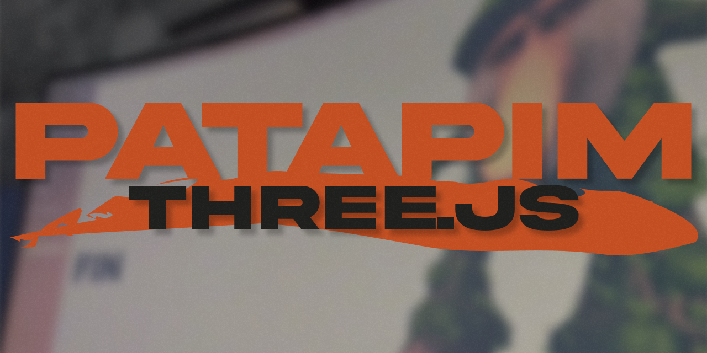

# 🌳 PATAPIM — React Three Fiber & Drei + GSAP ScrollTrigger

Ce projet est une démonstration simple de l'utilisation de [React Three Fiber](https://r3f.docs.pmnd.rs/getting-started/introduction?trk=public_post_comment-text),[React Three Drei](https://drei.docs.pmnd.rs/getting-started/introduction) et [ScrollTrigger](https://gsap.com/docs/v3/Plugins/ScrollTrigger/) dans une application Next.js.  
Il fait partie des démos créées pour mes vidéos TikTok sur le développement web.



---

## 🚀 Lancer le projet en local

### 1. Cloner le projet

```bash
git clone https://github.com/3mpty-s-playground/patapim.git
cd patapim
```

### 2. Installer les dépendances

```bash
npm i
```

### 3. Démarrer le serveur Next.js

```bash
npm run dev
```

Le projet sera accessible à l'adresse : http://localhost:3000

---

## 🛠️ Technos utilisées

-   Next.js
-   React Three Fiber
-   React Three Drei
-   GSAP (useGSAP, ScrollTrigger)
-   Sass
-   Typescript

---

## 📚 Ressources utiles

-   [Documentation de GSAP](https://gsap.com/docs/v3/)
-   [Documentation de React Three Fiber](https://r3f.docs.pmnd.rs/getting-started/introduction?trk=public_post_comment-text)
-   [Documentation de React Three Drei](https://drei.docs.pmnd.rs/getting-started/introduction)
-   [Ma vidéo TikTok du projet](https://www.tiktok.com/@3mpty_x/)
